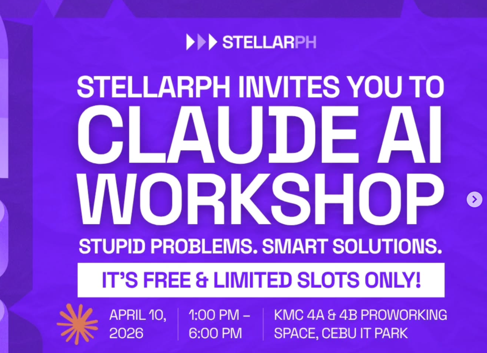
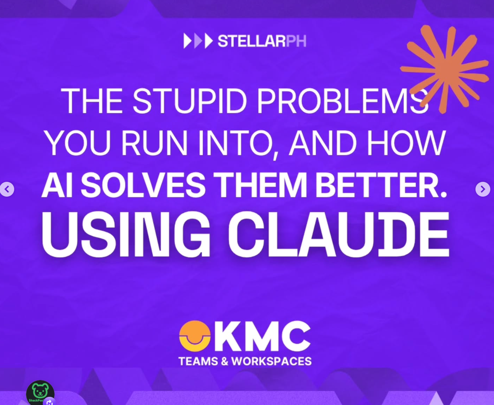
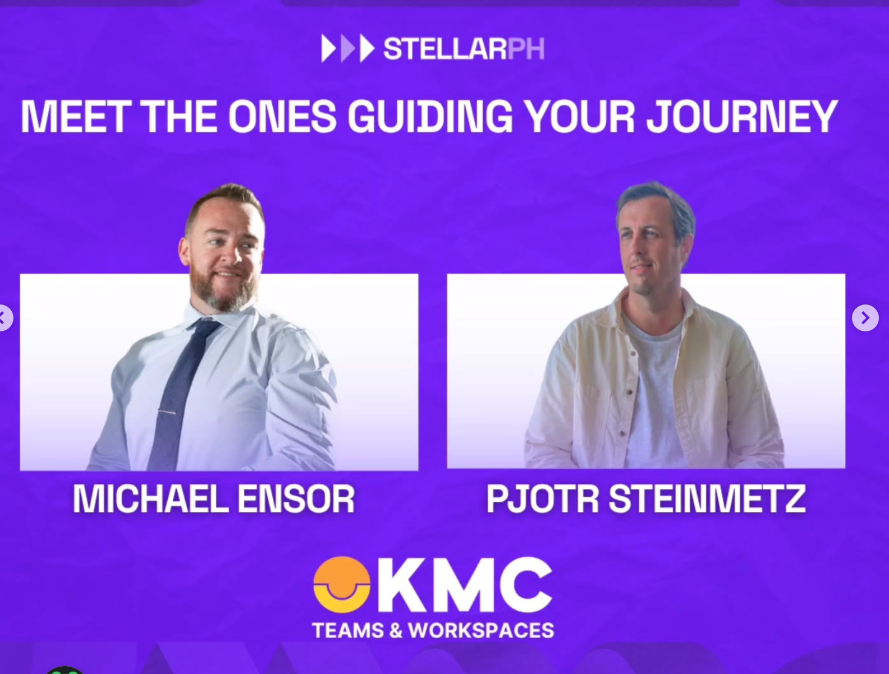

<div align="center">

<a href="https://arc-web.github.io/stellarph-claude-workshop/">
  
</a>

</div>

---

<div align="center">



<br/>



<br/>



<br/><br/>


<br/>

[](https://discord.gg/g2pJzjmV)

</div>

<br/>

---

<div align="center">

### This repo is your one-stop reference for everything in today's session.
**Guides. Prompts. Links. All in one place.**

*No advanced coding required. Just be ready to build.*

<br/>

## NEW HERE? START WITH THIS

[](SETUP.md)

*Everything you need to install - Claude, Claude Code, and how to get started - in plain English.*

</div>

---

<br/>

## How Today Works

<table>
<tr>
<td width="50px" align="center">🚀</td>
<td><strong>Start</strong> - Pjotr kicks things off</td>
</tr>
<tr>
<td align="center">🔨</td>
<td><strong>Build</strong> - You work in pods. Mike rotates to guide each group.</td>
</tr>
<tr>
<td align="center">💡</td>
<td><strong>Live Guidance</strong> - As questions come up, we pause and share with everyone</td>
</tr>
<tr>
<td align="center">🎤</td>
<td><strong>Present</strong> - Each pod shows what they built</td>
</tr>
</table>

**Location:** 16F, KMC Skyrise 4A & 4B Proworking Space, Cebu IT Park - **be there by 1 PM**

---

<br/>

## Before You Do Anything Else

> **1.** Join the Discord: https://discord.gg/g2pJzjmV - find your Pod channel (A through D)
>
> **2.** Get Claude: https://claude.ai - sign up if you haven't
>
> **3.** Star this repo so you can find it again later

---

<br/>

## What You'll Learn Today

| | Topic | What it means |
|---|-------|---------------|
| 🧠 | **Plan Mode** | How to think with Claude before you build |
| 🤝 | **Pod Collaboration** | Dividing work inside your group using AI |
| ⚡ | **Build Fast & Iterate** | Prompt, test, adjust, repeat |
| 🐙 | **GitHub for Teams** | Centralizing your work so everyone can access it |
| 🎙️ | **NotebookLM** | Turning your output into something presentable |
| 🔀 | **Multi-AI Workflows** | When to use Claude vs ChatGPT vs Gemini vs Grok |

---

<br/>

## Tech Stack for Today

| Tool | What it's for | Link |
|------|--------------|-------|
| **Claude** (web/desktop) | Main AI - planning, writing, thinking | [claude.ai](https://claude.ai) |
| **Claude Code** | AI in your terminal - for building | [docs](https://docs.anthropic.com/en/docs/claude-code/overview) |
| **GitHub** | Share and collaborate on your work | [github.com](https://github.com) |
| **NotebookLM** | Turn your output into a presentation | [notebooklm.google.com](https://notebooklm.google.com) |
| **AI Studio** | Google's free AI playground - experiment freely | [aistudio.google.com](https://aistudio.google.com) |
| **ChatGPT** | Alternative AI, great for some tasks | [chatgpt.com](https://chatgpt.com) |
| **Gemini** | Google's AI - strong on search + docs | [gemini.google.com](https://gemini.google.com) |
| **Grok** | xAI's model - great for current events | [x.ai/grok](https://x.ai/grok) |
| **Suno** | Type a description, get a full song back | [suno.com](https://suno.com) |

**[Full tools guide with descriptions and decision help](guides/tools.md)**

---

<br/>

## Guides in This Repo

<table>
<tr>
<td width="40px" align="center">⚙️</td>
<td><a href="guides/claude-code-quickstart.md"><strong>Claude Code Quickstart</strong></a></td>
<td>Install, authenticate, first commands, plan mode, troubleshooting</td>
</tr>
<tr>
<td align="center">💬</td>
<td><a href="guides/prompt-cheatsheet.md"><strong>Prompt Cheat Sheet</strong></a></td>
<td>Starter prompts and structures that actually work</td>
</tr>
<tr>
<td align="center">🐙</td>
<td><a href="guides/github-basics.md"><strong>GitHub Basics</strong></a></td>
<td>Repos, commits, sharing - the minimum you need today</td>
</tr>
<tr>
<td align="center">🛠️</td>
<td><a href="guides/tools.md"><strong>All Tools</strong></a></td>
<td>Every tool for today with descriptions, links, and a decision guide</td>
</tr>
<tr>
<td align="center">🚀</td>
<td><a href="guides/pod-kickoff.md"><strong>Pod Kickoff Guide</strong></a></td>
<td>How to pick your problem, define it, divide the work, and structure your repo</td>
</tr>
<tr>
<td align="center">🎤</td>
<td><a href="guides/presentation-guide.md"><strong>Presentation Guide</strong></a></td>
<td>Use NotebookLM to turn your repo into a pitch deck and video - step by step</td>
</tr>
<tr>
<td align="center">📁</td>
<td><a href="guides/using-your-repo.md"><strong>Using Your Repo</strong></a></td>
<td>How to commit work, pull updates, and collaborate without stepping on each other</td>
</tr>
</table>

---

<br/>

## Pod Repos - How They Work

Each pod has their own GitHub repo. This is where your team's work lives for the day. Think of it like a shared folder that everyone on your pod can add to, and that the facilitators can open at presentation time.

**Two repos. Two purposes:**

| Repo | What it is | What to use it for |
|------|-----------|-------------------|
| **This repo** (stellarph-claude-workshop) | The workshop hub | Guides, prompts, setup help, tools - read-only reference |
| **Your pod repo** (e.g. tindacheck, sakay-na) | Your team's workspace | Everything you build, write, or create today |

**How your pod repo works:**

- Everything your pod builds goes here - code, notes, docs, anything
- One person saves (commits) at a time - no two people writing the same file simultaneously
- The simplest way to add something: click **Add file** on your repo page, paste or upload, click **Commit changes**
- If you're using Claude Code, just tell it: *"save this to our pod repo"* and it will handle it
- Your repo is your presentation - Pjotr will open each pod's repo at the end of the session

**Your pod repo already has:**
- `README.md` - your team roster and a space to describe what you're building
- `notes.md` - structured notes template to fill in as you go (great for the presentation)
- `CLAUDE.md` - context that primes Claude Code with your pod's info the moment you open it

---

### Find Your Pod

| Pod | Leader | Members | Repo |
|-----|--------|---------|------|
| **Pod A** | Cris Militante | Kael, Carl Cabasag, Michael Ian Rule | [tindacheck](https://github.com/arc-web/tindacheck) |
| **Pod B** | Pierce Borinaga | Rumejan Barbarona, Chris, Earl Ceniza | [sakay-na](https://github.com/arc-web/sakay-na) |
| **Pod C** | Rome Nicolas | Ivhan, Guadalupe Carriaga | [fitalarm](https://github.com/arc-web/fitalarm) |
| **Pod D** | Hannah Athena Estrera | Charles Ivan Ogalesco, Jayne Carly Cabardo | [giftmaster](https://github.com/arc-web/giftmaster) |

---

## What Each Pod Built

*Updated live during the session - April 10, 2026*

<table>
<tr>
<td width="50%" valign="top">

### Pod A - TindaCheck
**Grocery Price Comparison App**

[](https://arc-web.github.io/tindacheck/)
[](https://github.com/arc-web/tindacheck)

**The problem:** Comparing grocery prices across stores is slow and manual - shoppers can't tell at a glance whether they're getting a good deal when sizes and pack counts differ.

**What they built:** A mobile-first web app where you scan a barcode or type a product name, add items to a list, and compare unit prices across different sizes and pack formats. Features a barcode scanner using the Open Food Facts API, size×packs formula for accurate unit pricing, dark/light mode, and a My List tab for side-by-side comparison.

**Team:** Cris Militante (Leader), Kael, Carl Cabasag, Michael Ian Rule

**Stack:** Single HTML file, Vanilla JS, Open Food Facts API

</td>
<td width="50%" valign="top">

### Pod B - Sakay Na!
**Cebu Jeepney Route Finder**

[](https://github.com/arc-web/sakay-na)

**The problem:** Getting around Cebu by jeepney is confusing for locals and visitors alike - there's no easy way to know which route to take from point A to point B.

**What they built:** A route finder web app that lets you pick your origin and destination and surfaces the right jeepney routes to take. Built for Cebu commuters who navigate the city's jeepney network daily.

**Team:** Pierce Borinaga (Leader), Rumejan Barbarona, Chris, Earl Ceniza

**Stack:** React, Vite

</td>
</tr>
<tr>
<td width="50%" valign="top">

### Pod C - FitAlarm
**GPS Fitness Alarm App**

[](https://arc-web.github.io/fitalarm/)
[](https://github.com/arc-web/fitalarm)

**The problem:** You tell yourself you'll go for a run tomorrow morning - but when the alarm goes off, you snooze it. There's nothing stopping you.

**What they built:** A fitness alarm that you literally cannot ignore. Set your activity (run, walk, cycling, gym), your distance or time goal, and an alarm time. When it fires, it plays a looping siren that won't stop until you start moving. GPS tracks your real distance in real time. Auto-detects inactivity via DeviceMotion API and resumes the alarm if you stop. Includes a workout summary screen with pace, distance, and time.

**Team:** Rome Nicolas (Leader), Ivhan, Guadalupe Carriaga

**Stack:** Single HTML file, Vanilla JS, GPS/DeviceMotion APIs

</td>
<td width="50%" valign="top">

### Pod D - GiftMaster
**Relationship Intelligence PWA**

[](https://github.com/arc-web/giftmaster)

**The problem:** People care about their relationships but forget important dates, struggle to pick the right gifts, and don't know how to consistently show thoughtfulness.

**What they built:** A progressive web app that stores rich profiles of the people in your life - personality types, love languages, preferences, important dates - and proactively suggests gifts, affirmations, and meaningful gestures at the right moments. Includes Supabase auth, a persons API with notes and chat, an AI agent layer for gift research, and a full VPS backend with task queuing.

**Team:** Hannah Athena Estrera (Leader), Charles Ivan Ogalesco, Jayne Carly Cabardo

**Stack:** Next.js 14, React, Tailwind CSS, Supabase, Node/Express agent API, BullMQ, Redis, ZeroClaw

</td>
</tr>
</table>

---

<br/>

## Quick Prompt Starters

Copy these, adjust for your situation, go.

```
You are helping me [goal]. Here is the context: [explain the situation].
My constraints are: [time/tools/skills]. Start by asking me clarifying questions before we begin.
```

```
I have a problem: [describe it]. Don't give me a solution yet.
First help me understand the root cause and the options I have.
```

```
Act as a senior [role]. Review what I've built so far: [paste your work].
Tell me what's working, what's missing, and what to do next.
```

---

<br/>

## Resources

- **Claude Code Docs** - https://docs.anthropic.com/en/docs/claude-code/overview
- **Anthropic Prompt Library** - https://docs.anthropic.com/en/prompt-library/library
- **NotebookLM Guide** - https://support.google.com/notebooklm
- **GitHub Getting Started** - https://docs.github.com/en/get-started

---

<br/>

## Follow the Organizers

<table>
<tr>
<td width="50%">

### Michael Ensor
#### Advertising Report Card

Advertising analysis, AI-powered ad strategy, and media accountability.

[](https://advertisingreportcard.com)
[](https://www.linkedin.com/company/advertising-report-card)
[](https://www.instagram.com/advertisingreportcard/)
[](https://www.facebook.com/AdvertisingReportCard/)
[](https://twitter.com/AdReportCard)

**Michael's Community:**

[](https://www.skool.com/stackpack)

</td>
<td width="50%">

### Pjotr Steinmetz
#### StellarPH

Building the tech and startup community in the Philippines.

[](https://stellarph.io)
[](https://ph.linkedin.com/company/stellarph)
[](https://www.instagram.com/stellarph.io/)
[](https://www.facebook.com/stellarphio)
[](https://x.com/stellarph)
[](https://www.threads.com/@stellarph.io)

</td>
</tr>
</table>

---

<div align="center">

<br/>


*Come with a problem. Leave with something that works.*

</div>
